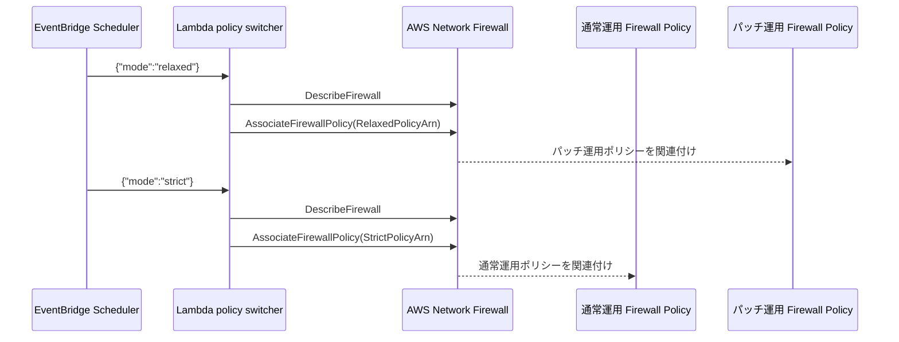

# アーキテクチャ

## 概要

この構成は、AWS Network Firewall の Firewall Policy をメンテナンス時間に合わせて切り替えるための PoC です。

通常運用時は厳格な Firewall Policy を関連付け、Patch Manager によるパッケージ更新時間だけ、一時的に通信許可範囲を広げた Firewall Policy に切り替えます。

## 構成

## 設計方針

### Firewall Policy を 2 つ用意する理由

AWS Network Firewall では、Firewall に 1 つの Firewall Policy を関連付けます。

通常運用ポリシーを直接編集して許可ルールを追加・削除する方法もありますが、メンテナンスのたびにルールを変更すると、作業ミスや戻し忘れのリスクが高くなります。

そのため、この PoC では以下の 2 つの Firewall Policy を事前に作成し、関連付けだけを切り替える設計にしています。

| Firewall Policy | 用途 |
| --- | --- |
| 通常運用ポリシー | 日常運用向けの厳格な通信制御 |
| パッチ運用ポリシー | パッチ適用時に必要な宛先を一時的に許可 |

### Cloudflare などの CDN 配下の宛先を考慮する理由

OS パッケージ更新では、リポジトリのメタデータ取得、パッケージ本体のダウンロード、証明書検証、リダイレクト先へのアクセスなどが発生します。

このとき、配布元が Cloudflare などの CDN 配下にある場合、通信先の IP アドレスや最終的な取得先が固定にならないことがあります。

また、リポジトリ URL が同じでも、ミラー、CDN、リダイレクト、地域、タイミングによって実際の接続先が変わることがあります。

固定のドメインリストだけで運用できる場合は、Firewall Policy の許可ルールに明示的に追加する方法が第一候補です。

一方で、更新先が変動しやすい、調査対象が多い、パッチ適用時間だけ通信を緩和したい、といった要件では、通常運用ポリシーとパッチ運用ポリシーを切り替える方式が現実的です。

### EventBridge Scheduler を使う理由

Patch Manager の Maintenance Window 前にパッチ運用ポリシーへ切り替え、終了後に通常運用ポリシーへ戻す必要があります。

EventBridge Scheduler を使用すると、Lambda を指定時刻に起動し、ペイロードで `strict` / `relaxed` の切り替え方向を渡せます。

このリポジトリでは、以下の 2 つのスケジュールを作成します。

| スケジュール | ペイロード | 用途 |
| --- | --- | --- |
| `switch-to-relaxed` | `{"mode":"relaxed"}` | メンテナンス前にパッチ運用ポリシーへ切り替え |
| `switch-to-strict` | `{"mode":"strict"}` | メンテナンス後に通常運用ポリシーへ戻す |

## 運用上の注意

パッチ運用ポリシーは、必要な時間帯だけ有効にする前提です。

スケジュールの初期状態は `DISABLED` とし、Lambda の単体テスト、Network Firewall の関連付け確認、Patch Manager の実行時間確認が完了してから有効化します。

Firewall Policy の切り替え結果は、Lambda の戻り値と CloudWatch Logs で確認します。

## 参考

- [AWS Network Firewall - AssociateFirewallPolicy](https://docs.aws.amazon.com/network-firewall/latest/APIReference/API_AssociateFirewallPolicy.html)
- [AWS Network Firewall - Service Authorization Reference](https://docs.aws.amazon.com/service-authorization/latest/reference/list_awsnetworkfirewall.html)
- [AWS Network Firewall - Stateful domain list rule groups](https://docs.aws.amazon.com/network-firewall/latest/developerguide/stateful-rule-groups-domain-names.html)
- [Amazon EventBridge Scheduler - Lambda Invoke target](https://docs.aws.amazon.com/scheduler/latest/UserGuide/managing-targets-templated.html)
- [AWS Systems Manager Patch Manager](https://docs.aws.amazon.com/systems-manager/latest/userguide/patch-manager.html)
